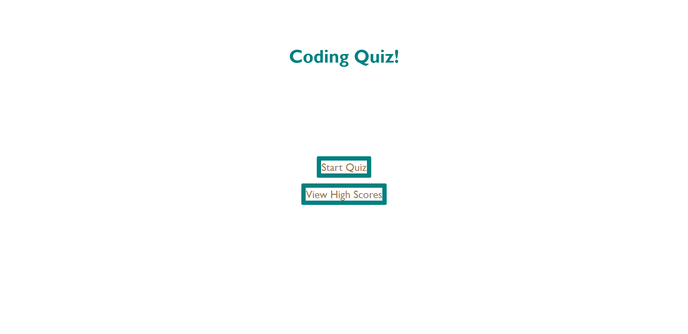
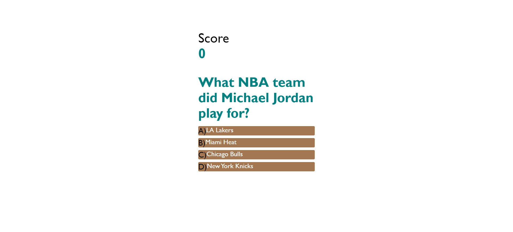
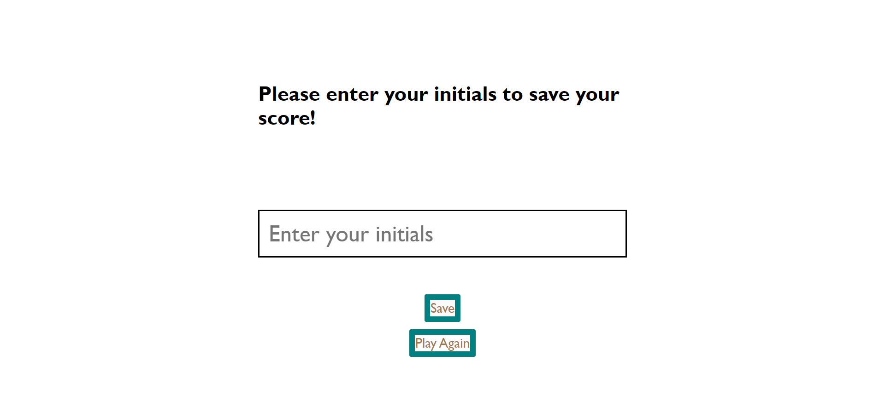
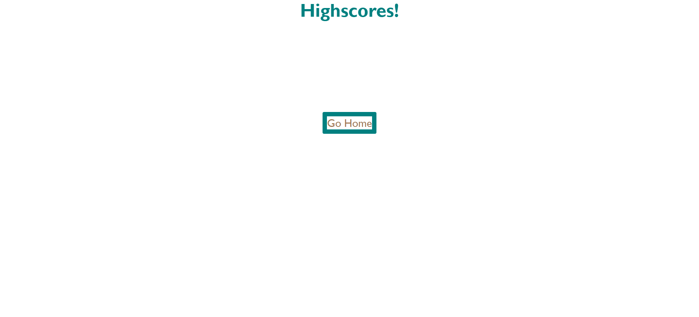

# Code-Quiz

## Description
HTML/CSS/JavaScript coding quiz game.

## Features
* Questions display in random order
* 4 random multiple choice questions
* Page allows the user to submit their initials for a high score list
* Highscore page lists user's scores
* Working on adding a timer feature

## GitHub Repo & Website Link
[Link to webstite](https://adambowers09.github.io/code-quiz/)

[Link to Github Repo](https://github.com/adambowers09/code-quiz)

## Screenshots

